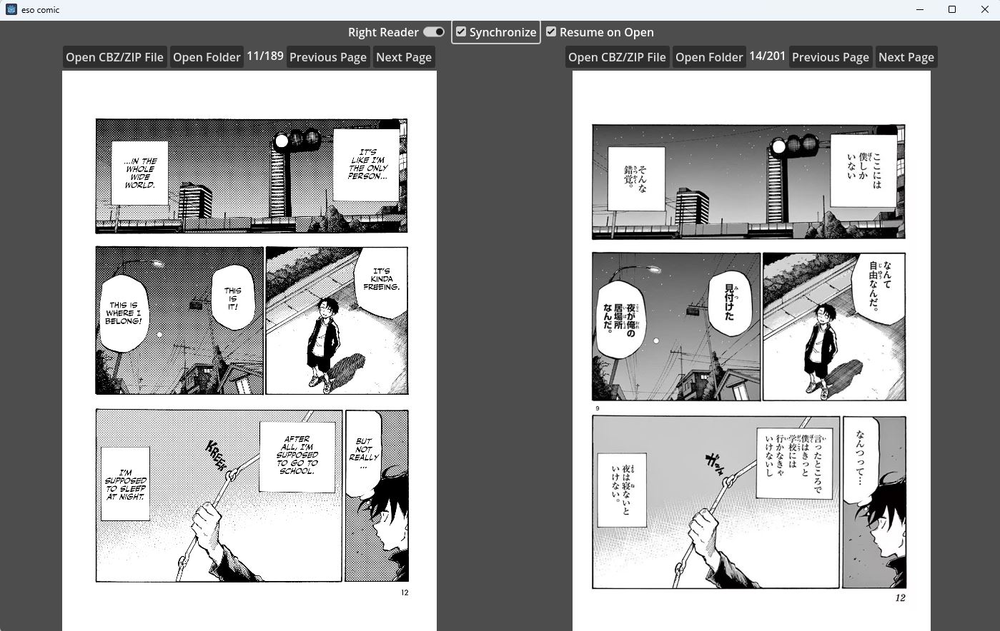

# eso comic

An open source comic book reader built with Godot. The aim is to have a side by side reader with japanese on one side and english on the other, but we'll see if we get that far.

## Supported Files

* CBZ files containing jpg/png files
* ZIP files containing jpg/png files
* Directories containing jpg/png files (nested directories currently unsupported)

## License

This application code is free and open source, licenced with the GNU GPL V3 license.  It may be read in [LICENSE.txt](LICENCE.txt).

## Copyright

This software is Copyright (c) Sean Esopenko 2023.