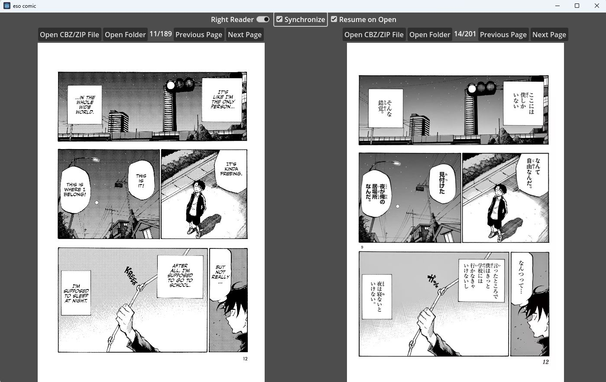

# eso comic

An innovative open-source comic book reader powered by [Godot](https://godotengine.org/), designed to offer a dual-language comic reading experience. Open two comics, each in a different language, and have their pages synchronized for dual reading language. Scroll through both comics simultaneously, as you immerse yourself in the captivating world of visual storytelling, seamlessly bridging English and Japanese, and other languages.

## Motivation

While learning a second language, I've desired to capture some of the nuances lost in translation when reading comics. Opening two reader applications works, but paging them independently was a pain. I wanted something that lets me page through them simultaneously.

## Supported Files

* [CBZ](https://en.wikipedia.org/wiki/Comic_book_archive) files containing jpg/png files
* ZIP files containing jpg/png files
* Directories containing jpg/png files (nested directories unsupported)

## License

This application code is free and open source, licenced with the GNU GPL V3 license.  It may be read in [LICENSE.txt](LICENCE.txt).

## Copyright

This software is Copyright (c) Sean Esopenko 2023.