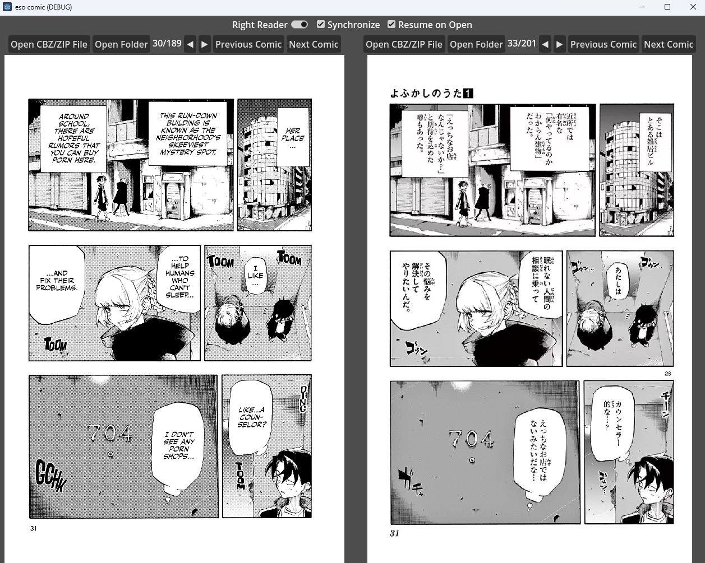

# eso comic

An open-source comic book reader powered by [Godot](https://godotengine.org/), designed to offer a dual-language comic reading experience. Open two comics, each in a different language, and have their pages synchronized for dual reading language. Scroll through both comics simultaneously, as you immerse yourself in the captivating world of visual storytelling, seamlessly bridging English and Japanese, and other languages.

## Download

Download the latest version of the app from the [Releases Page](https://github.com/sesopenko/eso_comic/releases).

## System Requirements

* Tested on Windows 11 but should work on Windows 7 & 10 as well
* Approx 100MB free RAM
* OpenGL ES 3.0 compatible GPU:
  * Nvidia Maxwell or newer (2014 or later)
  * AMD GCN or newer (2011 or later)
  * Intel Haswel or newer (2013 or later)

## Reporting Issues

If you are experiencing bugs when using the software please submit an issue using the [Project Issue Tracker](https://github.com/sesopenko/eso_comic/issues). If you don't already have a github user, you will have to [join Github](https://github.com/join).

## Supported Files

* [CBZ](https://en.wikipedia.org/wiki/Comic_book_archive) files containing jpg/png files
* ZIP files containing jpg/png files
* Directories containing jpg/png files (nested directories unsupported)

## Licensed GNU GPLv3

*GNU GENERAL PUBLIC LICENSE version 3* by [Free Software Foundation, Inc.](http://fsf.org/) converted to Markdown. License included in [LICENSE.txt](LICENSE.txt). Read the [original GPL v3](http://www.gnu.org/licenses/).

## Copyright

This software is Copyright (c) Sean Esopenko 2023. All rights reserved.